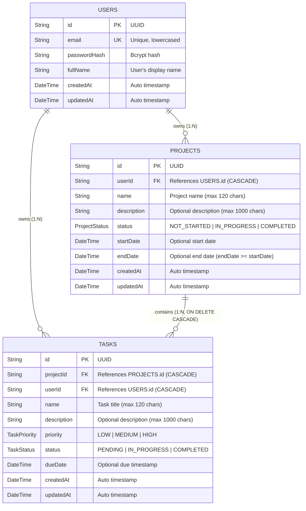

# Database Schema & Entity-Relationship (ER) Diagram

This project uses **PostgreSQL** normalized to the 3rd Normal Form (3NF) and managed via **Prisma ORM**.

## ER Diagram (Mermaid)

## Relational Constraints & Indexing Strategy

1. **Foreign Key Cascades (`ON DELETE CASCADE`)**:
   - Deleting a `User` cascades to delete all their `Project` records and `Task` records.
   - Deleting a `Project` cascades to delete all associated `Task` records.
2. **Direct `userId` on Tasks for Defense-in-Depth**:
   - `Task` maintains both `projectId` and `userId`. This allows efficient, single-index user-scoped task filtering (`WHERE userId = ?`) while enforcing that every task's `projectId` also belongs to the authenticated user.
3. **Optimized Indexes**:
   - `projects(userId)` - Fast retrieval of a user's projects.
   - `projects(status)` - Status filter index.
   - `tasks(projectId)` - Fast join / lookup of tasks by project.
   - `tasks(userId)` - Fast dashboard aggregations and cross-project task filtering.
   - `tasks(status)` & `tasks(priority)` - Filtering and dashboard counts.
